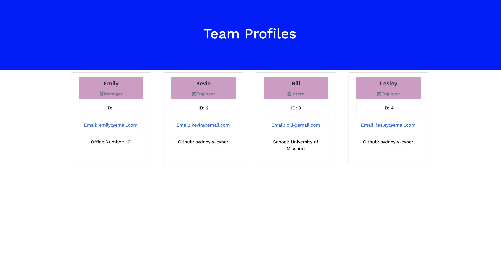

# Team Profile Generator
  
  ## Description
  This app creates a page that displays a teams basic info/profile. 

  ## Table of Contents
  * [Installation](#-installation)
  * [Usage](#-usage)
  * [Contributing](#-contributing)
  * [Tests](#-tests)
  * [License](#-license)
  * [Video](#-video)
  * [Questions](#-questions)
  ## Installation
  To install necessary dependencies, run the following command:
  npm i jest
  ## Usage
  Allows user quick access to teams info.
  ## Contributing 
  
  ## Tests
  To run tests, run the following command:
  
  ## License 
  
  This application uses a license from MIT 
  
 * Link: https://opensource.org/licenses/MIT
 ## Deployed
  ## Image
  
  ## Questions 
  If you have any questions about the repo, open an issue or contact me directly at sydneyw521@gmail.com. You can find more of my work at [https://github.com/sydneyw-cyber/](https://github.com/sydneyw-cyber/).
  
